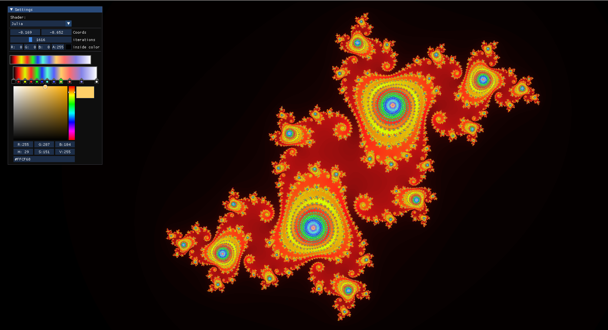
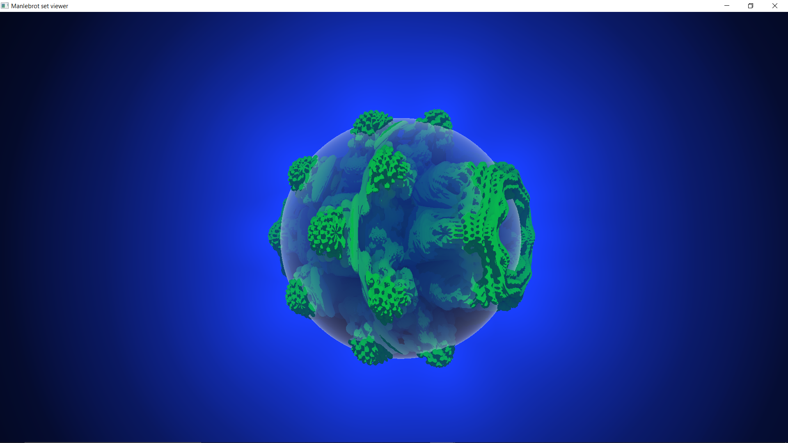
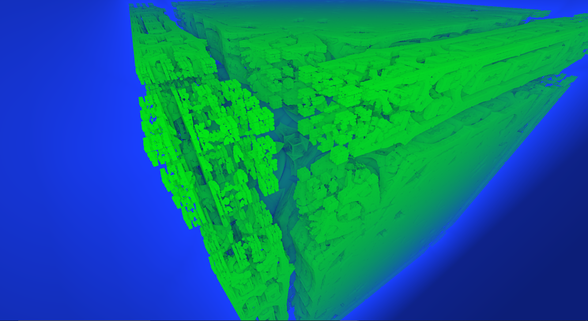
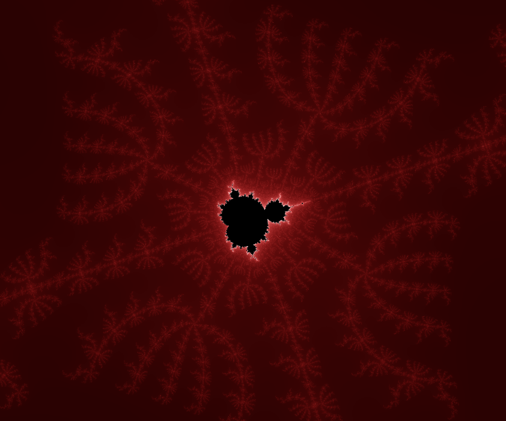
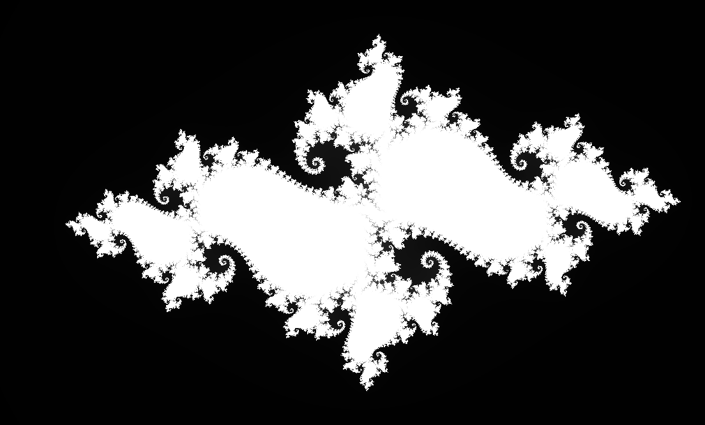

# **FractalVisualizer**

A program for visualizing fractals. Includes 5 2d fractals and 2 3d fractals.

Controls:
press escape to enable gui
in 3d mode, WASD and mouse to move the camera

In 2d mode, the gradient editor is a little funky be warned

