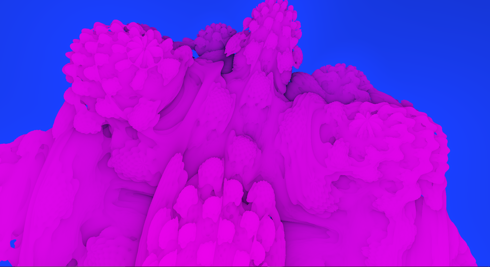

# **FractalVisualizer**

Program for visualizing fractals

Controls:
press escape to enable gui
in 3d mode, WASD and mouse to move the camera

In 2d mode, the gradient editor is a little funky be warned

